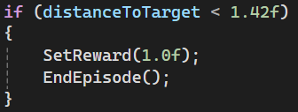

# Анализ данных в разработке игр
Отчет по лабораторной работе #5 выполнил:
- Мурашов Сергей Алексеевич
- НМТ-233004

## Отметка о выполнении заданий
| Задание   | Выполнение | Баллы |
| --------- | ---------- | ----- |
| Задание 1 | *          | 60    |
| Задание 2 | *          | 20    |
| Задание 3 | *          | 20    |

Знак "*" - задание выполнено; знак "#" - задание не выполнено;

## Работу проверили
- к.т.н., доцент Денисов Д.В.
- к.э.н., доцент Панов М.А.
- ст. преп., Фадеев В.О.

## Структура отчета
- Данные о работе: название работы, фио, группа, выполненные задания.
- Цель работы.
- Задание 1.
- Задание 2.
- Задание 3.
- Выводы.

## Цель работы
Познакомиться с программными средствами для создания системы машинного обучения и ее интеграции в Unity.

### Задание 1
Задание: Найти внутри C# скрипта “коэффициент корреляции” и сделать выводы о том, как он влияет на обучение модели.  
Ход работы:
- Найти и описать коэффициент корреляции.

  
Коэффициент корреляции равен 1.42. Коэффициент направляет агента, так как награда агенту начисляется только при выполнении условия, которое задает этот коэффициент. Если увеличивать коэффициент корреляции, то агент будет действовать менее точно, если наоборот, уменьшать, то затрачиваемое время на обучение будет увеличиваться. То есть можно сказать, что коэффициент корреляции это отношением между точностью действий и необходимым временем на обучение.

### Задание 2
Задание: Изменить параметры файла yaml-агента и определить какие параметры и как влияют на обучение модели. Привести описание не менее трех параметров.  
Ход работы:
- Изучить параметры файла yaml-агента.
- Поэкспериментировать с параметрами.
- Привести описание не менее трех параметров.

Параметры:
- Strength - Коэффициент, на который умножается вознаграждение.
- Max_steps - Количество шагов, которые необходимо выполнить.
- Num_epoch - Количество эпох при обучении модели.
- Learning_rate - Коэффициент скорости обучения.

### Задание 3
Задание: Привести примеры, для каких игровых задачи и ситуаций могут использоваться примеры 1 и 2 с ML-Agent’ом. Ответить на вопрос, в каких случаях проще использовать ML-агент, а не писать программную реализацию решения?  
Ход работы:
- Привести примеры.
- Ответить на вопрос.

Использовать агента из примера 1 можно, например:
- Для противников, чтобы находить игрока.
- Для спутников, чтобы они следовали за игроком.
А агента из примера 2 можно использовать почти в любой rts, для добывающих юнитов.

Агента проще использовать в случаях, когда нужно учитывать множество переменных, либо сделать поведение агента правдоподобным. Для таких ситуаций программная реализация возможна, но требует намного больше времени и подвержена ошибкам.

## Выводы
- Изучил интеграцию ML агентов в Unity
- Изучил конфигурационный файл для ML агента.
- Обучил модель для достижения цели.
